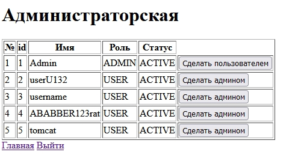

<h1>Веб приложение для хранение задач пользователя (CRUD)</h1>
Ver. 1.1

Автор Пичугин Дмитрий

Для скачивания репозитория введите команду:
```
git clone git@github.com:Pichugin1996/webtask.git
```
<h3>Возможности:</h3>

Регистрация пользователя
<details>
<summary>Изображение</summary>

Используется валидатор, при ошибках выводятся сообщения.

Осуществляется проверка на наличие уже существуещего пользователя.

Пароль хранится в виде кеша (BCrypt).
  

  
</details>

Авторизация пользователя
<details>
<summary>Изображение</summary>

Выводятся сообщения при ошибках.
  

  
</details>

Смена пароля у пользователя
<details>
<summary>Изображение</summary>
Выводятся сообщения при ошибках, используется валидатор.
  

  
</details>

Создание, редактирование, удаление задачи
<details>
<summary>Изображение</summary>
Выводятся сообщения при ошибках, используется валидатор.
  


  
</details>

Создания пользователя с ролью администратора, который может выдавать роли из админ панели
<details>
<summary>Изображение</summary>
  

  
</details>

<h3>В проекте используется:</h3>
Spring security
Spring boot
Spring data
Spring web
Thymeleaf
